# MCAD DASHBOARD

## Features

### Dashboard Tab
- [1: Cluster Avaiable Resources](#cluster-avaiable-resources)
- [2: Status Summary](#status-summary)
- [3: Appwrapper Summary](#appwrapper-summary)

### Metrics Tab
- [4: Cluster Status Summary Metrics](#cluster-status-summary-metrics)
- [5: Appwrapper Quota Summary](#appwrapper-quota-summary-metrics)
- [6: CPU Usage by Appwrapper](#cpu-usage-by-appwrapper)
- [7: Memory Usage by Appwrapper](#memory-usage-by-appwrapper)
- [8: CPU Request by Namespace](#cpu-request-by-namespace)
- [9: Memory Request by Namespace](#memory-request-by-namespace)
- [10: Refresh Rate](#refresh-rate)
- [11: Time Range](#time-range)

#### 1. Cluster Avaiable Resources

This section on the dashboard shows cluster avaiable resources such as:

- Avaiable CPU %
- Utilized CPU %
- Avaiable Memory %
- Utilized Memory %
- Avaiable CPU (Cores)
- Avaiable Memory (Mebibytes)

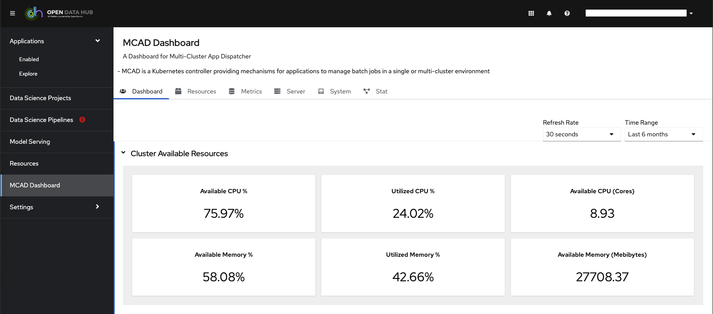

#### 2. Status Summary

The appwrapper status summary section that shows overall/ total appwrapper states including:

- Dispatched
- Queued
- Re-enqueued
- Other

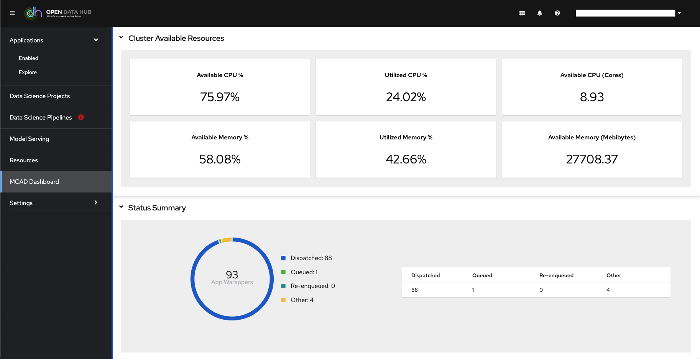

#### 3. Appwrapper Summary

Appwrapper summary table that shows appwrapper metadata including:

- Name of Appwrapper
- Namespace
- Date Created On
- Age of Appwrapper since creation
- Priority of Appwrapper
- Current State of Appwrapper 
- Number of Times Appwrapper was Re-enqueued
- Latest Message - which gives more details on current state of appwrapper

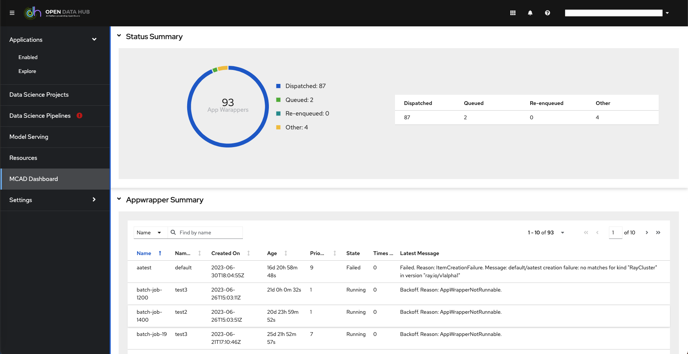

#### Appwrapper Summary Full Table
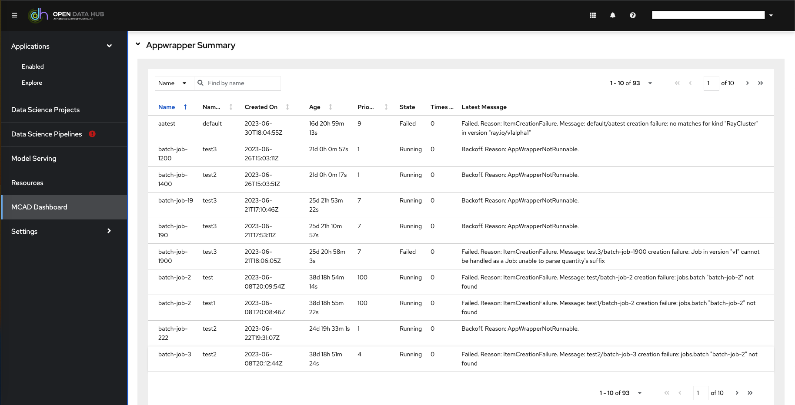

#### Appwrapper Summary Search

There is a search feature within the appwrapper summary table, the table is searchable by :

- Name of Appwrapper 
- Namespace
- Date Created On

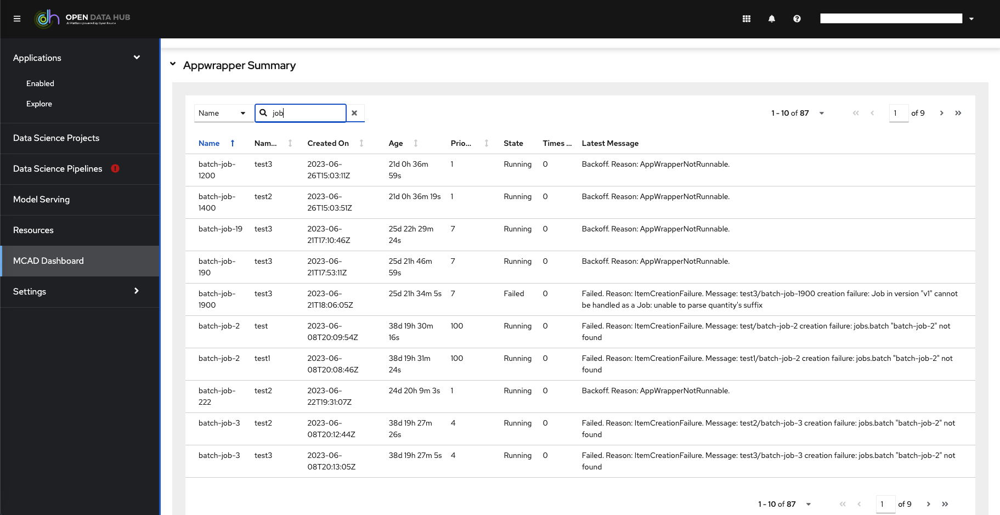

#### 4. Cluster Status Summary Metrics

This feature is under the metrucs tab, which shows the cluster resources summary such as:

- CPU Utilization %
- Memory Utilization %
- CPU Requests Commitment 
- Memory Requests Commitment
- CPU Limits Commitment 
- Memory Limits Commitment

#### 5. Appwrapper Quota Summary Metrics

This section displays a table of appwrapper quota sumary by namespace, it shows namespace specific information such as:

- Name of Namespace
- Number of Appwrappers in Namespace
- CPU Usage
- Memory Usage 
- CPU Requests
- Memory Requests
- CPU Limits
- Memory Limits 

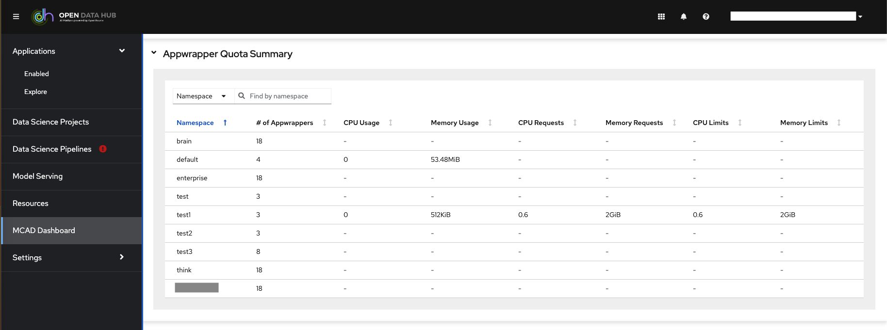

#### 6. CPU Usage by Appwrapper

The following graph shows CPU usage per appwrapper through a given time, the time range can be changed by using the Time Range drop down on top of the dashboard. 

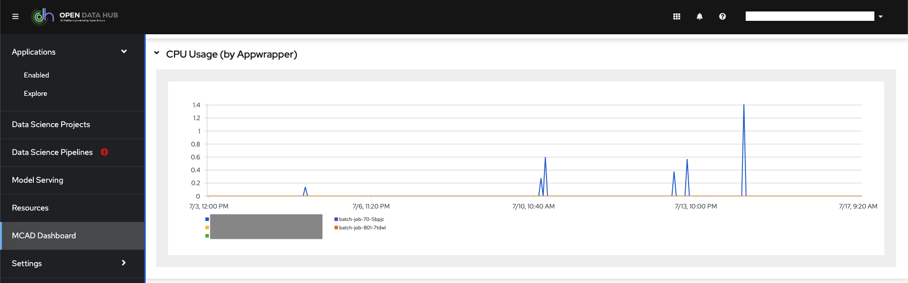

#### 7. Memory Usage by Appwrapper

The following graph shows Memory usage per appwrapper through a given time, the time range can be changed by using the Time Range drop down on top of the dashboard. 

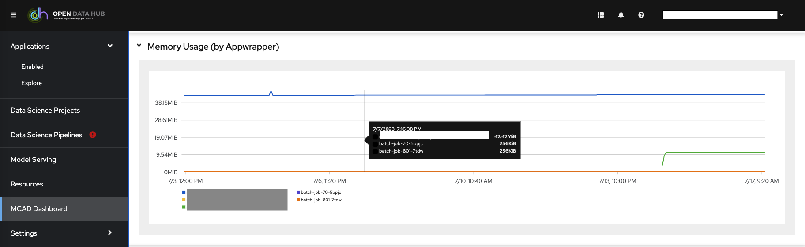

#### 8. CPU Request by Namespace

The following graph shows CPU Request per namespace through a given time, the time range can be changed by using the Time Range drop down on top of the dashboard. 

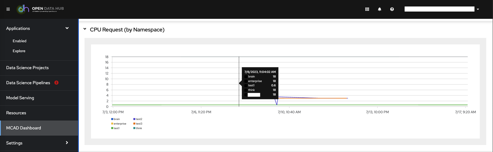

#### 9. Memory Request by Namespace

The following graph shows Memory request per namespace through a given time, the time range can be changed by using the Time Range drop down on top of the dashboard. 

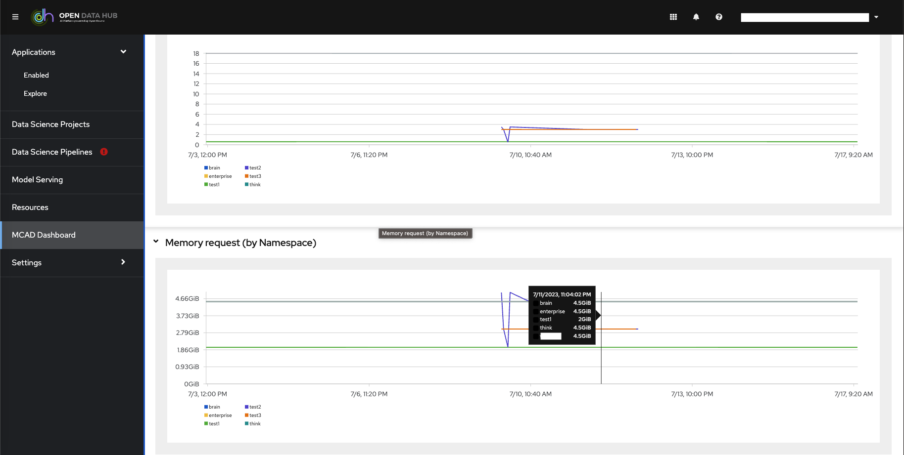

#### 10. Refresh Rate

The refresh rate to retrive data from server can be changed using the dropdown on top of the dashboard

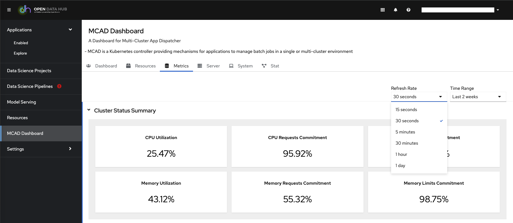

#### 11. Time Range

The time range can be changed by using the Time Range drop down on top of the dashboard. 

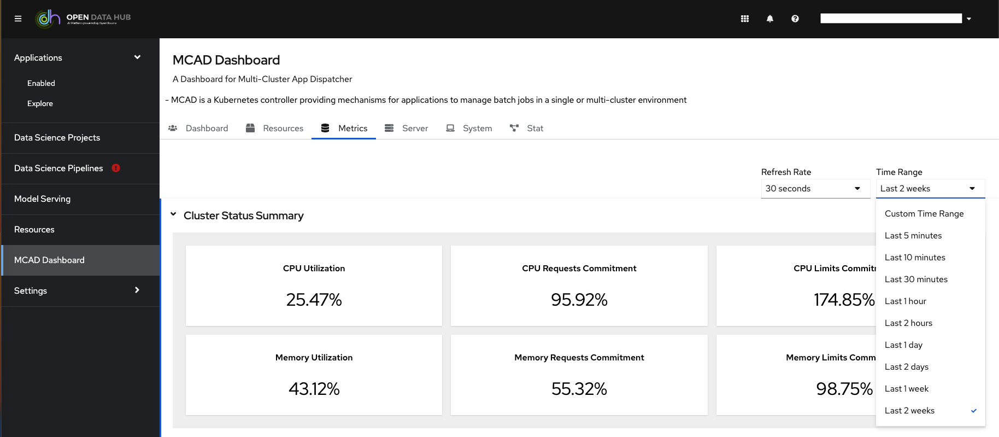