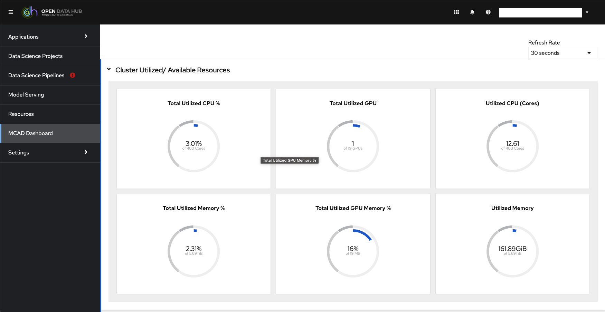
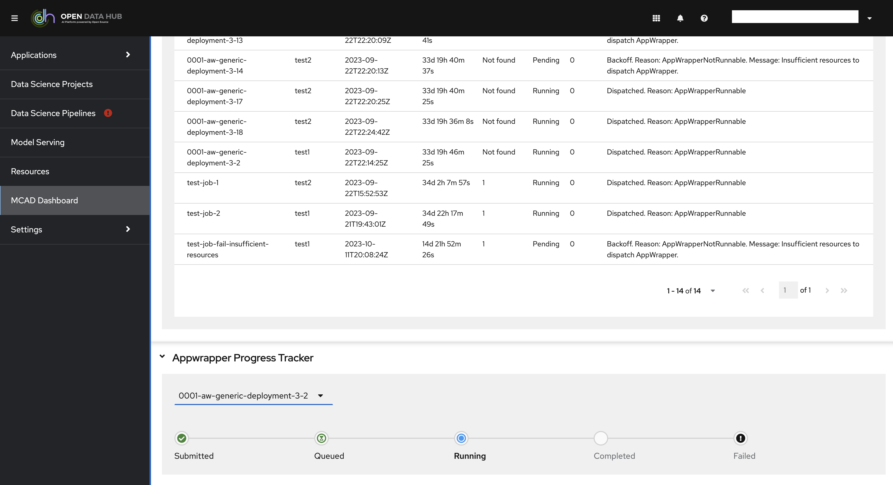
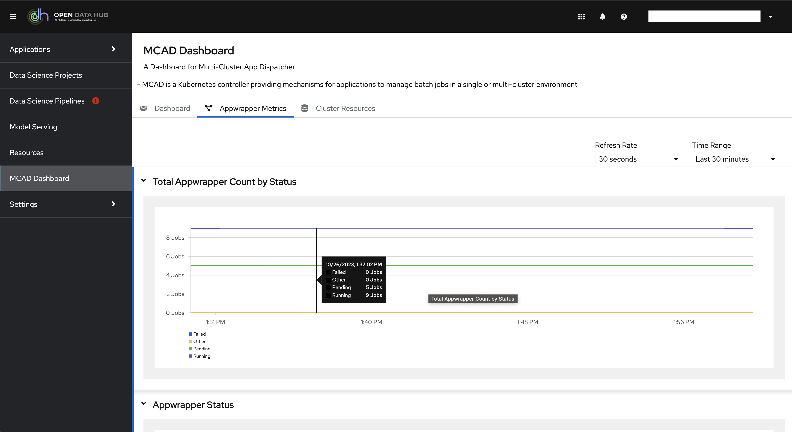
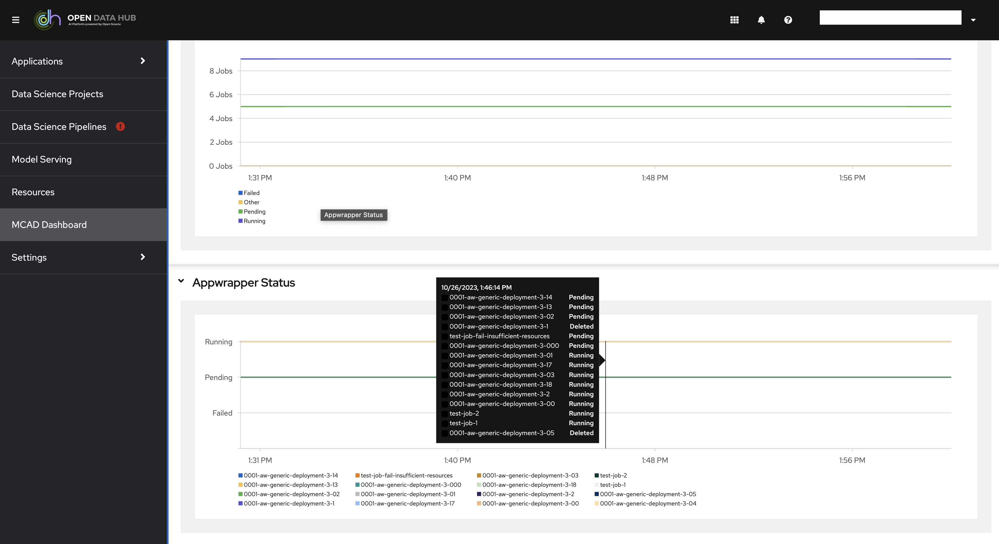

# MCAD DASHBOARD

## Features

### Dashboard Tab
- [1: Cluster Avaiable Resources](#1-cluster-avaiable-resources)
- [2: Status Summary](#2-status-summary)
- [3: Appwrapper Summary](#3-appwrapper-summary)
- [4: Appwrapper Progress Tracker](#4-appwrapper-progress-tracker)

### Appwrapper Metrics Tab
- [5: Total Appwrapper Count by Status](#5-total-appwrapper-count-by-status)
- [6: Appwrapper Status](#6-appwrapper-status)

### Cluster Resources Tab
- [7: Cluster Status Summary Metrics](#7-cluster-status-summary-metrics)
- [8: Appwrapper Quota Summary](#8-appwrapper-quota-summary-metrics)
- [9: CPU Usage by Appwrapper](#9-cpu-usage-by-appwrapper)
- [10: Memory Usage by Appwrapper](#10-memory-usage-by-appwrapper)
- [11: CPU Request by Namespace](#11-cpu-request-by-namespace)
- [12: Memory Request by Namespace](#12-memory-request-by-namespace)
- [13: Refresh Rate](#13-refresh-rate)
- [14: Time Range](#14-time-range)
- [15: Custom Time Range](#15-custom-time-range)

#### 1. Cluster Avaiable Resources

This section on the dashboard shows cluster avaiable resources such as:

- Avaiable CPU %
- Utilized CPU %
- Avaiable Memory %
- Utilized Memory %
- Avaiable CPU (Cores)
- Avaiable Memory (Mebibytes)

#### 2. Status Summary

The appwrapper status summary section that shows overall/ total appwrapper states including:

- Dispatched
- Queued
- Re-enqueued
- Other

#### 3. Appwrapper Summary

Appwrapper summary table that shows appwrapper metadata including:

- Name of Appwrapper
- Namespace
- Date Created On
- Age of Appwrapper since creation
- Priority of Appwrapper
- Current State of Appwrapper 
- Number of Times Appwrapper was Re-enqueued
- Latest Message - which gives more details on current state of appwrapper

#### Appwrapper Summary Full Table

#### Appwrapper Summary Search

There is a search feature within the appwrapper summary table, the table is searchable by :

- Name of Appwrapper 
- Namespace
- Date Created On

### 4. Appwrapper Progress Tracker

#### Appwrapper Metrics

This feature is under the appwrapper metrics tab, which shows the appwrapper mcad specific metrics from promethues:

#### 5. Total Appwrapper Count by Status

#### 6. Appwrapper Status

#### 7. Cluster Status Summary Metrics

This feature is under the metrics tab, which shows the cluster resources summary such as:

- CPU Utilization %
- Memory Utilization %
- CPU Requests Commitment 
- Memory Requests Commitment
- CPU Limits Commitment 
- Memory Limits Commitment

#### 8. Appwrapper Quota Summary Metrics

This section displays a table of appwrapper quota sumary by namespace, it shows namespace specific information such as:

- Name of Namespace
- Number of Appwrappers in Namespace
- CPU Usage
- Memory Usage 
- CPU Requests
- Memory Requests
- CPU Limits
- Memory Limits 

#### 9. CPU Usage by Appwrapper

The following graph shows CPU usage per appwrapper through a given time, the time range can be changed by using the Time Range drop down on top of the dashboard. 

#### 10. Memory Usage by Appwrapper

The following graph shows Memory usage per appwrapper through a given time, the time range can be changed by using the Time Range drop down on top of the dashboard. 

#### 11. CPU Request by Namespace

The following graph shows CPU Request per namespace through a given time, the time range can be changed by using the Time Range drop down on top of the dashboard. 

#### 12. Memory Request by Namespace

The following graph shows Memory request per namespace through a given time, the time range can be changed by using the Time Range drop down on top of the dashboard. 

#### 13. Refresh Rate

The refresh rate to retrive data from server can be changed using the dropdown on top of the dashboard

#### 14. Time Range

The time range can be changed by using the Time Range drop down on top of the dashboard. 

#### 15. Custom Time Range

The custom time range can be selected by using the Time Range drop down on top of the dashboard, and clicking on Custom Time Range.  

